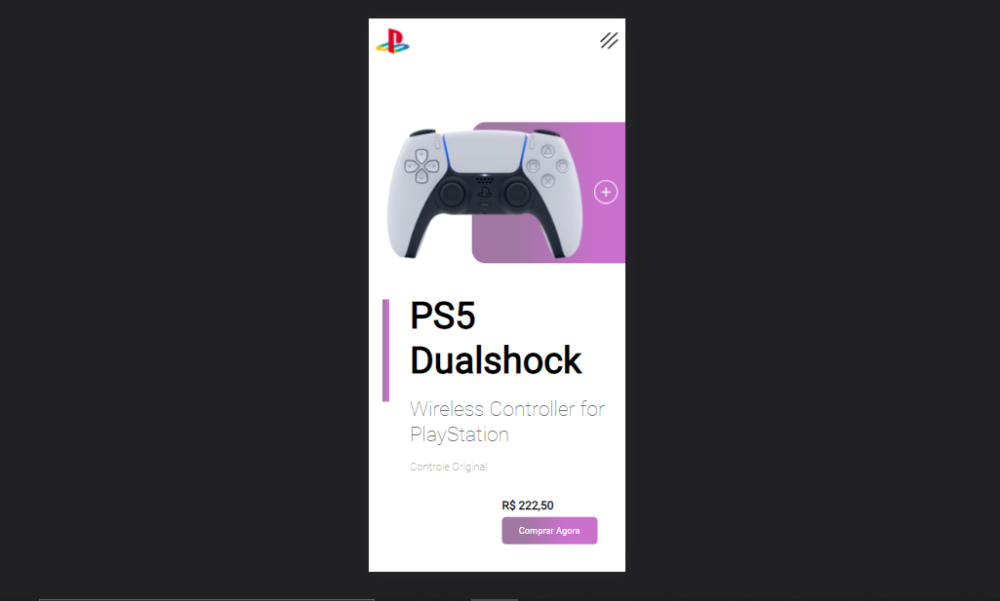

# PS5-Controller

> Esse foi o meu primeiro projeto responsivo.

### Tecnolgias usadas

Lista das tecnologias usadas:

- [x] HTML
- [x] CSS
- [x] JavaScript

## 📱 Resultado no dispositivo móvel

## 💻 Sobre o Projeto

Além de ser responsivo, colocamos animações no controle e no botão compre aqui, e ao passar o mouse nos botões eles mudam de cor,
graças ao comando houver.
 

Agradecemos às seguintes pessoas que contribuíram para este projeto:

<table>
  <tr>
    <td align="center">
      <a href="#">
         
        
          <b>Weslei França</b>
        
      </a>
    </td>
    <td align="center">
    
  </tr>
</table>

[⬆ Voltar ao topo](#nome-do-projeto) 

