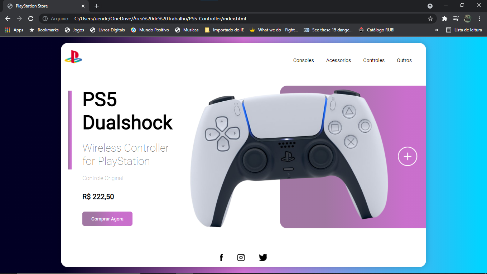

# PS5-Controller

<h1 align="center">
    
</h1>

## 💻 Sobre o projeto

Esse foi o meu primeiro projeto responsivo. Além de ser responsivo, colocamos animações no controle e no botão compre aqui e ao passar o mouse nos botões eles mudam de cor graças ao comando houver.  

### Mobile

  

### Web

  

## 🛠 Tecnologias

As seguintes ferramentas foram usadas na construção do projeto:

- [x] HTML
- [x] CSS
- [x] JavaScript

## 📝 Licença

Este projeto esta sobe a licença MIT.

Feito com ❤️ por Weslei França 👋🏽 [Entre em contato!](https://www.linkedin.com/in/tgmarinho/)

